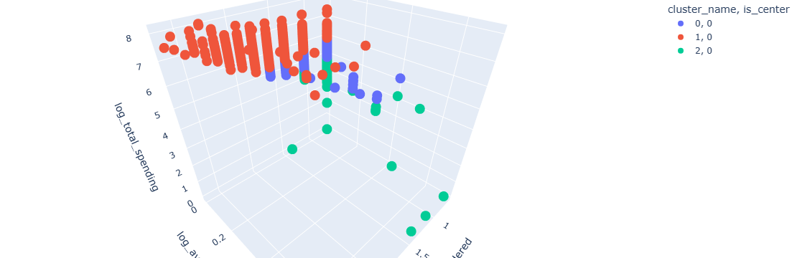

## Customer-segmentation-analysis-using-Kmeans-clustering

Customer segmentation enables a company to customize its relationships with its customers.

When you perform customer segmentation, you find similar characteristics in each customer’s behavior and needs. Customers are segmented into groups based on clusters of similar characteristics. Using these groups, we can tailor targeted marketing activities, launch features aligning with specific customer needs, or develop a product roadmap.

We will work with an actual e-commerce Nov. 2018 - April 2019 sales dataset and apply K-means clustering to the dataset while going through the following steps;

1. Business Case
2. Data Preparation
3. Segmentation with K-means Clustering
4. Hyperparameter Tuning
5. Visualization and Interpretation of the Results

### Business Case
*Can the customers be grouped to develop customized relationships based on customer behavior?*

I will approach this question from a behavioral aspect (alternatives can be geographical or demographical perspectives) to better understand customers’ spending and ordering habits with the following features: Number of products ordered, Average return rate, and Total spending.

### Data Preparation
The data has been anonymized for confidentiality reasons.
We will be calculating 3 features with which we will be calculating our ML model;

1. Number of products ordered: This is calculated by counting the product_type ordered per customer.
2. Average return rate: This is the ratio of returned_item_quantity to the ordered_item_quantity averaged for all orders per customer.
3. Total spending: This is the aggregated sum of total sales, which is the final amount after taxes and returns per customer.

### Segmentation with K-means Clustering
We are going to use K-means algorithm from scikit-learn. 

This algorithm is easy to understand, fits well to large datasets in terms of computing times, and guarantees convergence. 
However, when centroids are initialized randomly, the algorithm may not assign the points to the groups in the most optimal way.
One important consideration is the selection of k. In other words, how many groups should be formed? 
In the next step, we are going to choose k which is the most important hyperparameter of K-means.

### Hyperparameter Tuning
While selecting k, we are going to decide against the optimization criteria of the K-means, inertia, using the elbow method. We are going to build different K-means models with k values 1 to 10 and save the corresponding inertia values.
With the elbow method, we are going to select the k value where the decrease in the inertia stabilizes.

When k=1 inertia is at the highest, meaning data is not grouped yet. Inertia decreases steeply until k=2. Between k=2 and 3, the curve continues to decrease fast.

At k=3, the descent stabilizes and continues linearly afterward, forming an elbow at k=3 This points out the optimal number of customer groups is 3.

### Visualization and Interpretation of the Results
Let’s plug in, k=3 to K-means and visualize how customer groups are created.

Red: Customers who ordered 1 to 13 products, with an average total spending of 600 and an average return rate of 0.0. It makes the most favorable customer group for the company.

Green: Customers who ordered at least one product, with a maximum total spending of 100 and having the highest average return rate. They might be newcomers to the e-commerce website.

Blue: Customers who ordered 1 to 4 products, with an average total spending of 300 and a maximum return rate of 0.5.

